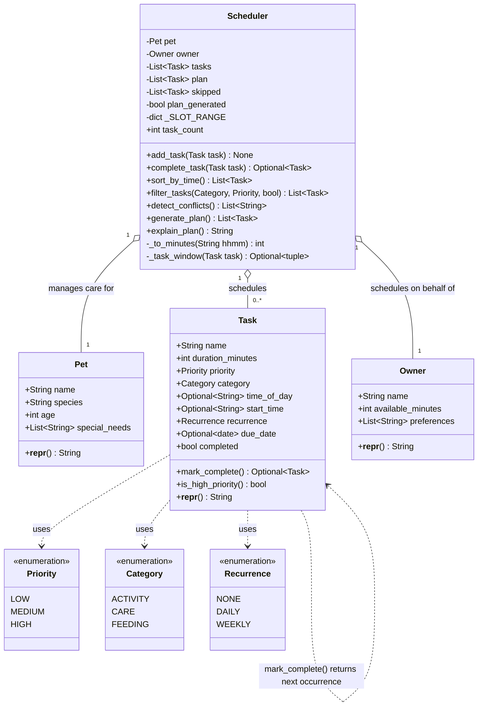

```mermaid
classDiagram
    class Priority {
        <<enumeration>>
        LOW
        MEDIUM
        HIGH
    }

    class Category {
        <<enumeration>>
        ACTIVITY
        CARE
        FEEDING
    }

    class Recurrence {
        <<enumeration>>
        NONE
        DAILY
        WEEKLY
    }

    class Pet {
        +String name
        +String species
        +int age
        +List~String~ special_needs
        +__repr__() String
    }

    class Task {
        +String name
        +int duration_minutes
        +Priority priority
        +Category category
        +Optional~String~ time_of_day
        +Optional~String~ start_time
        +Recurrence recurrence
        +Optional~date~ due_date
        +bool completed
        +mark_complete() Optional~Task~
        +is_high_priority() bool
        +__repr__() String
    }

    class Owner {
        +String name
        +int available_minutes
        +List~String~ preferences
        +__repr__() String
    }

    class Scheduler {
        -Pet pet
        -Owner owner
        -List~Task~ tasks
        -List~Task~ plan
        -List~Task~ skipped
        -bool plan_generated
        -dict _SLOT_RANGE
        +int task_count
        +add_task(Task task) None
        +complete_task(Task task) Optional~Task~
        +sort_by_time() List~Task~
        +filter_tasks(Category, Priority, bool) List~Task~
        +detect_conflicts() List~String~
        +generate_plan() List~Task~
        +explain_plan() String
        -_to_minutes(String hhmm) int
        -_task_window(Task task) Optional~tuple~
    }

    Task ..> Priority : uses
    Task ..> Category : uses
    Task ..> Recurrence : uses
    Task ..> Task : mark_complete() returns next occurrence
    Scheduler "1" o-- "1" Pet : manages care for
    Scheduler "1" o-- "1" Owner : schedules on behalf of
    Scheduler "1" o-- "0..*" Task : schedules
```
